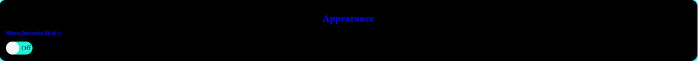

# Light to Dark Mode Chrome Extension
This is a Chrome Extension that allows users to switch between light mode and dark mode on any website they are visiting. The extension is designed to make it easy for users to switch between modes without having to navigate through a website's settings.


## Preview


Download the code from the Github repository or get it from the Chrome Web Store.
Open the Chrome browser and navigate to the Extensions page (chrome://extensions/)
Enable Developer mode by toggling the switch in the top right corner.
Click the "Load unpacked" button in the top left corner and select the folder where you downloaded the code.
The extension will now be installed and ready to use.
Usage
To use the extension, simply click on the icon in your Chrome toolbar. This will toggle the website between light mode and dark mode. The extension will remember your preference for each website, so if you switch a website to dark mode, it will stay in dark mode even if you close the tab or browser.

### Getting Started
> Clone this github repository
```
git clone  
 ```
> Move to cloned project
```
cd chromeExtension
 ```
> Install all dependencies
```
npm install
 ```
 > Run Server
```
npm start
 ```
Finally,
Runs the app in the development mode.\
Open [http://localhost:3000](http://localhost:3000) to view it in your browser.

The page will reload when you make changes.\
You may also see any lint errors in the console

## Features
The Light to Dark Mode Chrome Extension comes with several features:

Toggle between light and dark mode with a single click.
Automatic detection of light mode or dark mode.
Option to switch to dark mode on all websites.
Option to exclude specific websites from switching to dark mode.
Option to have a ability of Vice-Versa Function

## Feedback
If you have any feedback or suggestions for improving the Light to Dark Mode Chrome Extension, please feel free to reach out to me. If you are interested in contributing to the project, you can fork the Github repository and create a pull request with your changes.

## License
This project is licensed under the MIT License. See the LICENSE file for more information.

## Show us love by giving a ⭐


